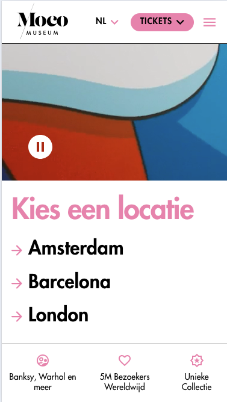
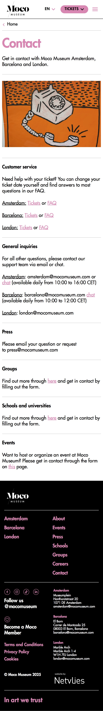
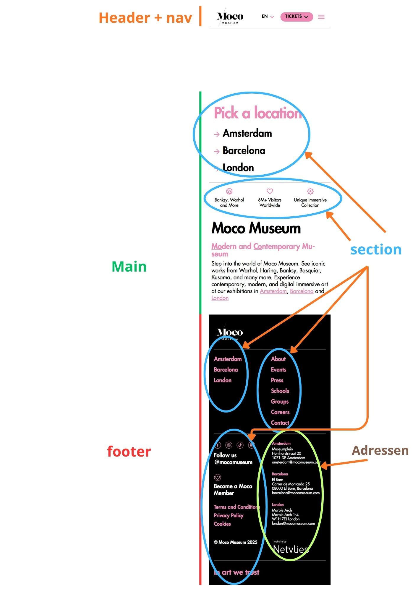
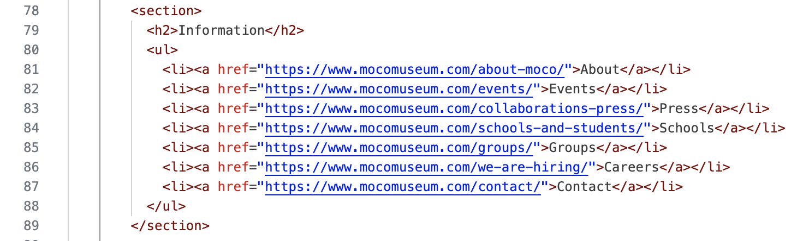

# Procesverslag
Markdown is een simpele manier om HTML te schrijven.  
Markdown cheat cheet: [Hulp bij het schrijven van Markdown](https://github.com/adam-p/markdown-here/wiki/Markdown-Cheatsheet).

Nb. De standaardstructuur en de spartaanse opmaak van de README.md zijn helemaal prima. Het gaat om de inhoud van je procesverslag. Besteedt de tijd voor pracht en praal aan je website.

Nb. Door *open* toe te voegen aan een *details* element kun je deze standaard open zetten. Fijn om dat steeds voor de relevante stuk(ken) te doen.

## Jij

  
uitwerken voor kick-off werkgroep

  ### Auteur:
  Juliette Young

  #### Je startniveau:
  Blauw

  #### Je focus:
  surface en later wil ik het responsive maken als ik tijd heb
 

## Je website

  
uitwerken voor kick-off werkgroep

  ### Je opdracht:
	<a href="https://www.mocomuseum.com/nl/amsterdam/">Moco museum</a>
  

  #### Screenshot(s) van de eerste pagina (small screen): 
  hier de naam van de pagina  
  

  #### Screenshot(s) van de tweede pagina (small screen):
  hier de naam van de pagina  
  
 

## Toegankelijkheidstest 1/2 (week 1)

  
uitwerken na test in 2e werkgroep

  ### Bevindingen
  Lijst met je bevindingen die in de test naar voren kwamen:
  De website voldoet niet aan de regel dat media niet automatisch mogen afspelen. De achtergrondvideo start meteen wanneer je de site opent, en dat mag eigenlijk niet. Het enige positieve is dat er in ieder geval geen geluid onder zit.
  
  Ook mis ik een duidelijke skip to main content-link. Die zou zichtbaar moeten worden wanneer je hem focust, maar ik heb hem nergens kunnen vinden.
  
  Daarnaast opent een van de links in een nieuw tabblad zonder dat de gebruiker daarvoor wordt gewaarschuwd. Je ziet het niet aan de link en een screenreader meldt het ook niet, wat niet toegankelijk is.
  
  High-contrast-modus wordt ook niet ondersteund door de website.
  
  Verder heb ik getest met prefers-reduced-motion: reduce, maar de animaties en de achtergrondvideo blijven gewoon actief. De site houdt dus geen rekening met gebruikers die gevoelig zijn voor beweging.
  
  De pauzeknop op de achtergrondvideo is wit, maar omdat de video zelf veel wisselt tussen lichte en donkere beelden, verandert de leesbaarheid steeds. Soms valt de knop bijna weg tegen de achtergrond, waardoor het contrast niet altijd voldoende is.
  
  Ook de roze linkteksten (zoals “Barcelona” en “Londen”) hebben te weinig contrast met de witte achtergrond. Hetzelfde geldt voor de grote roze heading “Tentoonstellingen in Amsterdam”; die haalt de vereiste contrastratio van 3:1 ook niet.
  

## Breakdownschets (week 1)

  
uitwerken na afloop 3e werkgroep

  ### de hele pagina: 
  

  ### dynamisch deel (bijv menu): 
  

  ### wellicht nog een dynamisch deel (bijv filter): 
  

## Voortgang 1 (week 2)

  
uitwerken voor 1e voortgang

  ### Stand van zaken
  hier dit ging goed & dit was lastig (neem ook screenshots op van delen van je website en code)

   Ik twijfelde of ik een <address> element moest gebruiken voor de museumlocaties. Uiteindelijk heb ik hiervoor gekozen omdat dit semantisch beter past.
   Bron: https://www.w3schools.com/tags/tag_address.asp

  Ik heb mijn website in het Engels. mijn vraag is moet ik " <html lang="nl"> " veranderen naar "<html lang="en">"
  

  ik heb dit er in staan maar mag de zin zo lang of is een deel overbodig? 
  		(<li><a href="https://www.mocomuseum.com/amsterdam/">Amsterdam</a>Link naar amsterdam moco museum pagina u bevind zich nu op de algemene pagina </li>)
  

  footer
  Normaal gebruik je classes voor styling en structuur. Zonder deze hulpmiddelen moest ik semantische elementen veel bewuster inzetten om toch een duidelijke opbouw te behouden. Vooral de footer met meerdere blokken was lastiger zonder classes om delen te onderscheiden.

  De footer heeft veel informatie: locaties, informatie, social media, juridische links en adressen. Het was even zoeken hoe ik dit semantisch kon opdelen in <section>s zonder extra classes, zodat het wel duidelijk blijft. Ik twijfel nog wel of ik het niet beter in een nav kan zetten maar dat ga ik een keer vragen.
  

  ### Agenda voor meeting
  samen met je groepje opstellen

  | student 1      | student 2          | student 3    | student 4        |
  | ---            | ---                | ---          | ---              |
  | dit bespreken  | en dit             | en ik dit    | en dan ik dat    |
  | en dat ook nog | dit als er tijd is | nog een punt | dit wil ik zeker |
  | ...            | ...                | ...          | ...              |

  ### Verslag van meeting
  hier na afloop snel de uitkomsten van de meeting vastleggen

  - punt 1
  - punt 2
  - nog een punt
  - ...

## Voortgang 2 (week 3)

  
uitwerken voor 2e voortgang

  ### Stand van zaken
  hier dit ging goed & dit was lastig (neem ook screenshots op van delen van je website en code)

  ### Agenda voor meeting
  samen met je groepje opstellen

  | student 1      | student 2          | student 3    | student 4        |
  | ---            | ---                | ---          | ---              |
  | dit bespreken  | en dit             | en ik dit    | en dan ik dat    |
  | en dat ook nog | dit als er tijd is | nog een punt | dit wil ik zeker |
  | ...            | ...                | ...          | ...              |

  ### Verslag van meeting
  hier na afloop snel de uitkomsten van de meeting vastleggen

  - punt 1
  - punt 2
  - nog een punt
- ...

## Toegankelijkheidstest 2/2 (week 4)

  
uitwerken na test in 9e werkgroep

  ### Bevindingen
  Lijst met je bevindingen die in de test naar voren kwamen (geef ook aan wat er verbeterd is):

## Voortgang 3 (week 4)

  
uitwerken voor 3e voortgang

  ### Stand van zaken
  hier dit ging goed & dit was lastig (neem ook screenshots op van delen van je website en code)

  ### Agenda voor meeting
  samen met je groepje opstellen

  | student 1      | student 2          | student 3    | student 4        |
  | ---            | ---                | ---          | ---              |
  | dit bespreken  | en dit             | en ik dit    | en dan ik dat    |
  | en dat ook nog | dit als er tijd is | nog een punt | dit wil ik zeker |
  | ...            | ...                | ...          | ...              |

  ### Verslag van meeting
  hier na afloop snel de uitkomsten van de meeting vastleggen

  - punt 1
  - punt 2
  - nog een punt
  - ...

## Eindgesprek (week 5)

  
uitwerken voor eindgesprek

  ### Je uitkomst - karakteristiek screenshots:
  

  ### Dit ging goed/Heb ik geleerd: 
  Korte omschrijving met plaatjes

  

  ### Dit was lastig/Is niet gelukt:
  Korte omschrijving met plaatjes

  

## Bronnenlijst

  
continu bijhouden terwijl je werkt

  Nb. Wees specifiek ('css-tricks' als bron is bijv. niet specifiek genoeg). 
  Nb. ChatGpT en andere AI horen er ook bij.
  Nb. Vermeld de bronnen ook in je code.

  1. bron 1
  2. bron 2
  3. ...

